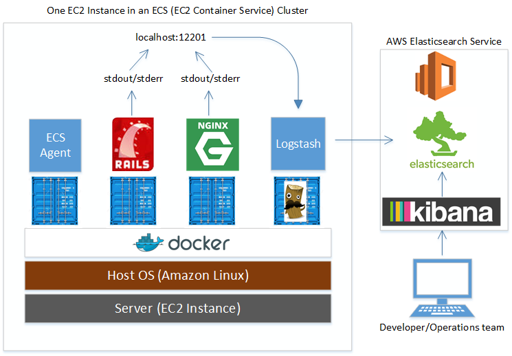

# docker-logging

Easily pipe `docker logs` output from an
[AWS ECS](https://aws.amazon.com/ecs/) into
[AWS Elasticsearch service](https://aws.amazon.com/elasticsearch-service/)
for later visualization with Kibana using Logstash (aka the ELK
Stack).

This repository may become deprecated when the support for the
[AWS CloudWatch Logs logging driver](https://docs.docker.com/engine/reference/logging/awslogs/)
is
[added to the ECS agent](https://github.com/aws/amazon-ecs-agent/issues/9). [@samuelkarp wrote the logging driver](https://github.com/docker/docker/pull/15495)
and happens to work for AWS on ECS, so this seems inevitable.



# Local Setup

Prerequisites: Docker >= 1.8.  If you use Docker-compose, make sure
its version >= 1.5

1. Spin up an Elasticsearch server. The easiest way to do this is via
   the
   [AWS Elasticsearch Service](https://aws.amazon.com/elasticsearch-service/):

  1. Click "Create a new domain"
  2. Set a domain name
  3. Use the default options
  4. Set an Access Policy.  I suggest applying both IAM access to
     write to elasticsearch from your AWS account and IP-specific
     access so you can view logging outputs in Kibana.  Here's a
     sample policy:

     ```
{
  "Version": "2012-10-17",
  "Statement": [
    {
      "Effect": "Allow",
      "Principal": {
        "AWS": "arn:aws:iam::xxxxxxxxxxxx:root"
      },
      "Action": "es:*",
      "Resource": "arn:aws:es:us-west-2:xxxxxxxxxxxx:domain/my-elasticsearch-domain/*"
    },
    {
      "Sid": "",
      "Effect": "Allow",
      "Principal": {
        "AWS": "*"
      },
      "Action": "es:*",
      "Resource": "arn:aws:es:us-west-2:xxxxxxxxxxxx:domain/my-elasticsearch-domain/*",
      "Condition": {
        "IpAddress": {
          "aws:SourceIp": [
            "192.168.1.0",
            "192.168.1.1"
          ]
        }
      }
    }
  ]
}
```

2. Start docker logging container.

        docker run -it -e ELASTICSEARCH_HOST=search-pschmitt-es-test-3pm4igbk4q3nr5racsahpugud4.us-west-2.es.amazonaws.com \
                   -p 12201:12201/udp tdgp/material_selector_logstash /start_logstash.sh

   If you do not have access to the `tdgp/material_selector_logstash`
   Docker repo, build it yourself first:

         docker build -t tdgp/material_selector_logstash .

3. Start a Docker container which you want logged using the Docker
   logging flags.  Here's a simple example:

         docker run --log-driver=gelf --log-opt gelf-address=udp://localhost:12201 \
                    busybox /bin/sh -c 'while true; do echo "Hello $(date)"; sleep 1; done'

# Deploying to an ECS Cluster

1. Create an Elasticsearch Cluster with
   [AWS Elasticsearch Service](https://aws.amazon.com/elasticsearch-service/)
   (see setup, above) and make a note of the Elasticsearch URL.

2. Configure ECS cluster.  Here's how you do it with CloudFormation:

  1. The
     [AWS ECS-optimized AMI](https://aws.amazon.com/marketplace/pp/B00U6QTYI2)
     (2015.09.b) is running docker-1.7.1 as of this
     writing. [A post in the AWS forums](https://forums.aws.amazon.com/thread.jspa?messageID=683482)
     states "[AWS is] testing 1.9 RC and plan to deliver it this
     month."  It's not ready yet, so we must manually upgrade Docker.

     We also fetch the Logstash configuration & pass in the
     Elasticsearch URL and start the Logstash container.  Add this to
     the `commands` section of your
     [AWS::Cloudformation::Init](http://docs.aws.amazon.com/AWSCloudFormation/latest/UserGuide/aws-resource-init.html).

     ```
     "03_upgrade_docker_for_log_driver_support": {
       "command": {
         "Fn::Join": [
             "",
             [
                 "#!/bin/bash -xe\n",
                 "service docker stop\n",
                 "cp /usr/bin/docker /usr/bin/docker.old\n",
                 "curl -o /usr/bin/docker https://get.docker.com/builds/Linux/x86_64/docker-1.9.0\n",
                 "service docker start\n"
             ]
           ]
         }
       },
       "04_configure_docker_logstash": {
         "command": {
           "Fn::Join": [
             "",
             [
                 "#!/bin/bash -xe\n",
                 "mkdir -p /etc/logstash/conf.d\n",
                 "docker run -d --restart=always  -p 12201:12201/udp",
				 " -e ELASTICSEARCH_HOST=",
				 {
				   "Ref": "ElasticsearchAddress"
				 },
				 " -e AWS_REGION=",
				 {
				   "Ref": "AWS::Region"
				 },
				 " -e ENVIRONMENT=",
				 {
				   "Ref": "Environment"
				 },
				 "tdgp/material_selector_logstash /start_logstash.sh\n"
             ]
           ]
         }
       }
     ```

  2. Add ElasticsearchAddress to your `Parameters` section:

     ```
   "ElasticsearchAddress": {
     "Type": "String",
     "Description": "Host and port of Elasticsearch server for logging. With the AWS Elasticsearch Service use Endpoint:80. Ensure the access policy permits access."
   }
   ```

3. Submit an ECS task definition which uses the gelf logging
   driver. The ContainerDefinition should include a section like this:

        "logConfiguration": {
           "logDriver": "gelf",
           "options": {
             "gelf-address": "udp://localhost:12201",
             "tag": "nginx"
            }
        }

   Note the log option `tag` requires Docker > 1.9.  For Docker 1.8,
   use `gelf-tag`.  Otherwise, ECS may report

   > Failed to initialize logging driver: unknown log opt 'tag' for gelf log driver".

   As of this writing, the CloudFormation
   [AWS::ECS::TaskDefintiion](http://docs.aws.amazon.com/AWSCloudFormation/latest/UserGuide/aws-properties-ecs-taskdefinition-containerdefinitions.html)
   does not support the
   [logConfiguration](http://docs.aws.amazon.com/AmazonECS/latest/APIReference/API_LogConfiguration.html)
   settings of an ECS TaskDefinition.  Watch the
   [Cloudformation Release History](http://docs.aws.amazon.com/AWSCloudFormation/latest/UserGuide/ReleaseHistory.html)
   to be notified when this will be supported.


# Notes

* The
  [Graylog Extended Log Format (GELF)](https://www.graylog.org/resources/gelf/)
  driver communicates via UDP, which can silently dropping logging
  events.  TCP/syslog can provide a more robust solution.  See
  [this StackOverflow](http://stackoverflow.com/a/33816663/40785) for
  some more details.
* There are many ways to pipe `docker logs` into Elasticsearch.
  [This docker-logstash repo](https://github.com/edefaria/docker-logstash)
  demonstrates a couple of options (gelf, lumberjack, syslog & tcp).

# Links

* [Grok Debugger](http://grokdebug.herokuapp.com/)
* [ELK and Docker-1.8](http://www.labouisse.com/how-to/2015/09/14/elk-and-docker-1-8/) and [ELK, Docker, and Spring Boot](http://www.labouisse.com/how-to/2015/09/23/elk-docker-and-spring-boot/)
* [Automating Docker Logging: ElasticSearch, Logstash, Kibana, and Logspout](http://nathanleclaire.com/blog/2015/04/27/automating-docker-logging-elasticsearch-logstash-kibana-and-logspout/)
